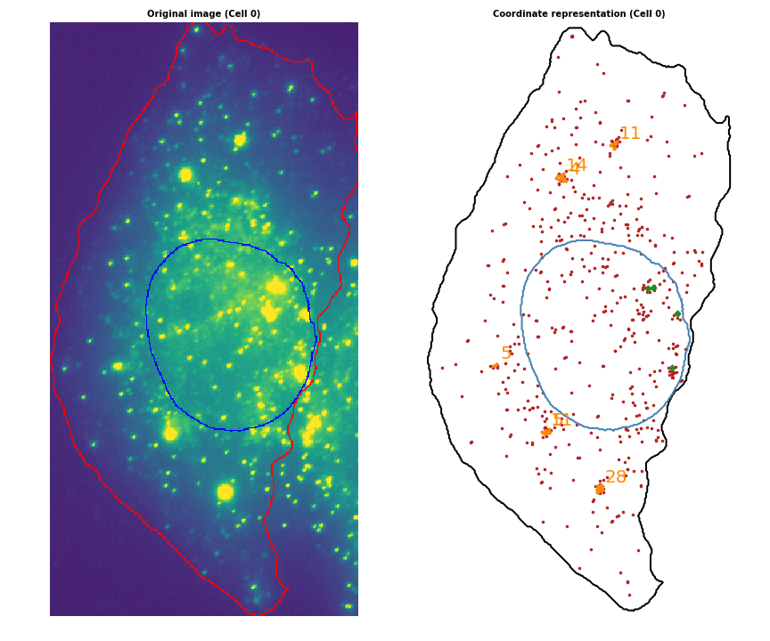

# Big-FISH examples

**Big-FISH-examples** is a repository where we gather images, notebooks and scripts to apply and test [Big-FISH](https://github.com/fish-quant/big-fish).

| Cell image (smFISH channel) and its coordinates representation |
| ------------- |
|  |
